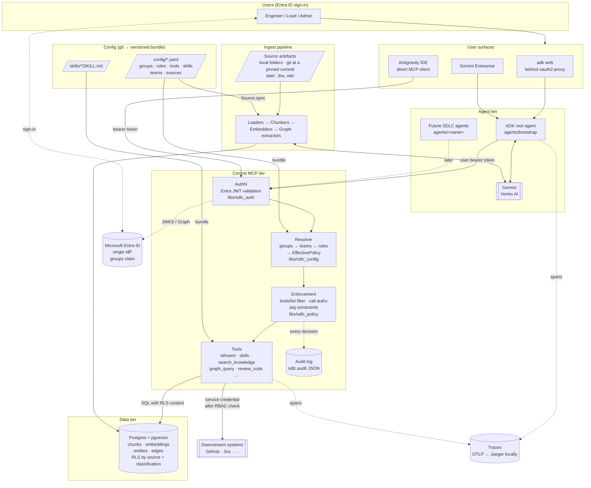
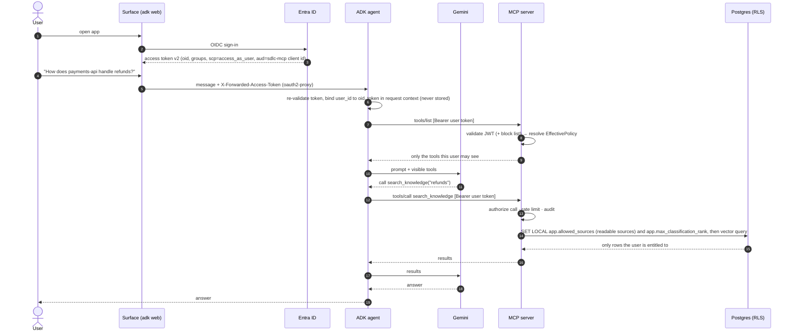
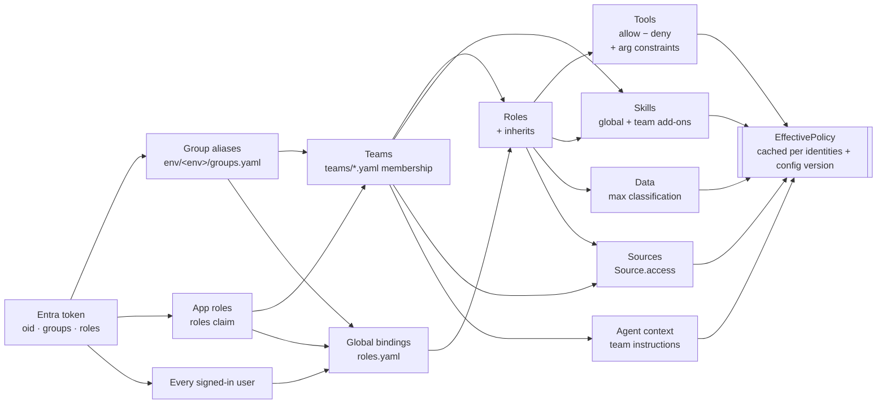
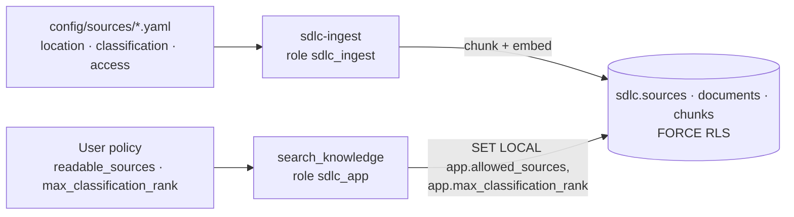
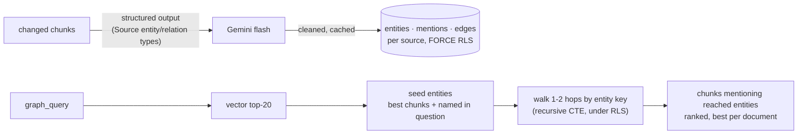
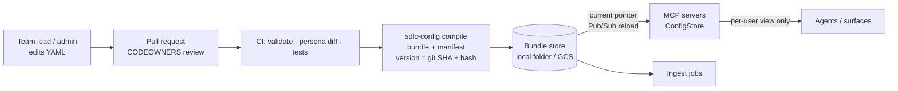

# Agentic SDLC — System Architecture

High-level view of the platform. For staged delivery, config syntax and exit gates, see
[IMPLEMENTATION_PLAN.md](IMPLEMENTATION_PLAN.md).

## 1. What the system does

Engineers use an AI assistant for SDLC work: writing user stories, reviewing designs,
generating tests, reviewing code, and answering questions about their team's systems. The
assistant is a **Google ADK agent** built from **skills**, which are reusable instruction
packages. The skills, tools and team knowledge it can use all come from a central **MCP
server**.

Each user sees **only** the tools, skills and knowledge their Entra ID group membership
allows. This is called *selective disclosure*. Declarative YAML files in `config/` decide the
rules, and the MCP server enforces them, backed by Postgres row-level security.

## 2. System diagram

## 3. Components

| Component | Location | Responsibility |
|---|---|---|
| **Surfaces** | external | Where users talk to the agent. adk web (dev), Gemini Enterprise (business users, needs GCP), Antigravity (IDE; connects straight to MCP; verified with a dev token). |
| **Entra ID** | external | The single identity provider. Tokens carry `oid`, `upn` and `groups`. |
| **ADK agents** | `agents/` | Conversation and reasoning with Gemini. They discover skills and call tools through MCP, forwarding the **user's** token. They make **no** authorization decisions, never read `config/` and hold no DB credentials. Conversations are stored per user (see "Conversation storage"). |
| **MCP server(s)** | `mcp_servers/` | The single enforcement point. Validates tokens (and the block list), resolves the user's `EffectivePolicy`, filters what the user can see, authorizes and rate-limits every call, and audits it (with a `trace_id` when tracing is on). |
| **Shared libs** | `libs/` | `sdlc_auth` (identity), `sdlc_config` (config, resolver, bundles), `sdlc_policy` (authorization, rate limits), `sdlc_db` (RLS-scoped DB access, graph), `sdlc_web` (agent web app: user binding, conversation retention), `sdlc_agent` (per-session team context). |
| **Skills** | `skills/` | SKILL.md instruction packages. They hold content only; access is declared in `config/`. Naming: lowercase kebab-case, globally unique (global `skills/core/<name>/`, team add-ons `skills/teams/<team>/<name>/`, team instructions `skills/teams/<team>/AGENT_ADDENDUM.md`); folder = frontmatter `name` = config key. |
| **Config** | `config/` | YAML that declares groups, roles, teams, tools, skills, sources, rate limits and the block list. Served from the watched folder in dev, or from immutable, verified bundles (`sdlc-config compile`). |
| **Ingest** | `ingest/` | Reads source artefacts declared in `config/sources/` (local folders, git repositories at a pinned commit), chunks and embeds them, extracts a knowledge graph, and tags every row with `source_id` + `classification`. |
| **Postgres + pgvector** | `db/` | Vector search plus the knowledge graph (as edge tables). Row-level security is the last line of defense for data access. |
| **Observability** | compose profile `observability` | OpenTelemetry traces (agent, MCP server, Postgres) to Jaeger when `OTEL_EXPORTER_OTLP_ENDPOINT` is set; no prompts, responses, tokens or argument values in spans. |
| **CI** | `.github/workflows/ci.yml` | Lint, config validation + PR permission diff, tests on a pgvector service, Terraform checks. No secrets or cloud access. |

## 4. Request flow — a user asks a question

The security checkpoints in this flow are:
1. A request with no valid Entra token, or from a blocked user (`blocked.yaml`), gets 401.
2. Tools the user may not use are never listed, so the model can't even try them.
3. Every call is re-authorized, including its arguments (e.g. which repo), then rate-limited per user.
4. Postgres filters rows by the user's readable sources and classification ceiling, even if a tool has a bug.
5. Every allow or deny is audited with the config version and the rule that matched.

### Agent -> MCP connections and correlation

- **Headers per MCP call:** the agent's `McpToolset` uses `sdlc_auth.adk.agent_header_provider`, which sends
  `Authorization: Bearer <user token>` and `X-SDLC-Agent-Session: <ADK conversation id>`.
- **One MCP session per conversation:** ADK pools MCP client sessions (and caches tool lists) by the hash of
  those headers. Because the conversation id is one of them, the agent keeps **one MCP client session per
  (user token, conversation)**, not one per user token. Consequences:
  - conversations never share an MCP connection, even for the same user;
  - a little more connection setup (one `initialize` per conversation, and again when the token refreshes);
  - tool lists are fetched per conversation, so policy changes show up in new conversations immediately.
  - The per-turn invocation id is deliberately **not** a header: that would open a new MCP session every turn.
- **Server side is stateless:** with the current MCP protocol the client sends no `Mcp-Session-Id` and every
  request stands alone on the server. The "session" exists only on the client (ADK's pooled connection).
- **Correlating a conversation:** every `sdlc.audit` record carries
  - `agent_session_id`: the conversation (client-supplied, recorded when well-formed, never used for decisions);
  - `request_id`: one MCP request (a tool list or a tool call; shared by the records it produces and by the
    `sdlc.mcp` traceback of a crash);
  - `mcp_session_id`: only when a client sends `Mcp-Session-Id` (older protocol clients);
  - `trace_id`: when tracing is on. One agent turn is one trace across agent → MCP server → Postgres: the MCP
    client carries the trace context in the request's `_meta`, not in an HTTP header, so the one-session-per-
    conversation rule is untouched. Direct MCP clients (Antigravity) send no conversation id and start their own
    server-side traces.
  `docker compose logs mcp-bootstrap | grep <agent_session_id>` shows everything one conversation did.

## 5. Identity and authorization model

- **Identity** is the Entra `oid` plus group membership and, for enterprise tenants, Entra **app roles**
  (`roles` claim). Entra is the only trusted issuer. Every signed-in user also matches `everyone: true`
  bindings, which grant only the `signed-in` basics (`ping`, `whoami`).
- **Teams** define who belongs, which roles each group gets, and team add-ons (extra skills, extra agent instructions, tool argument limits).
- **Roles** are reusable permission bundles. A role can inherit from another.
- **Data access** is granted only by each source's own `access` block. The sensitivity ceiling comes from roles.
- **Deny wins**, and anything not explicitly allowed is denied.
- **Block list (E3):** `config/env/<env>/blocked.yaml` refuses listed users on every request, even with a valid
  token, from the next config reload; audited as `auth_failure` reason `blocked`.
- **Rate limits:** a platform baseline plus team limits (overall and per tool; the most generous of the user's
  teams wins), per user and minute, checked after authorization; refusals are audited as `rate_limited`.
- **Argument limits** (e.g. allowed repos) are unioned across the teams that set them; a team that sets none
  never widens access; `unconstrained` roles (admin) skip them.
- **Enforcement (Stage 3, tools):** the MCP server filters `tools/list` to the caller's policy and authorizes every
  `tools/call` (tool + arguments) before it runs; each decision is audited with the config rule that matched.
  `whoami(explain=true)` shows a user their own policy; admins use `config_explain`; `sdlc-config diff` shows
  per-persona permission changes on every config change.

### Data access (Stage 5)

- **Two checks, one source of truth.** The resolver turns `Source.access` (teams, roles, groups) into the
  user's granted sources, takes the highest `max_classification` across the user's roles, and keeps the
  granted sources whose **current** classification is at or below that ceiling (`readable_sources`). The
  MCP server searches only those, and Postgres RLS filters every row on the same values (set per
  transaction by `sdlc_db.scoped()`) plus each row's own classification stamp. A bug in tool code cannot
  widen access beyond what RLS allows.
- **Classification changes:** raising a source's classification in config takes effect on the next
  request (it leaves `readable_sources`), with no re-ingest and no DB writes by the MCP server. Lowering
  it takes effect after ingest re-stamps the rows; until then the stricter stamp applies (fail closed).
- **Fail closed:** without the RLS context a query returns no rows, for every role including the table
  owner (`FORCE ROW LEVEL SECURITY`). No database role is a superuser or has BYPASSRLS.
- **Roles:** `sdlc_owner` owns the schema and runs migrations; `sdlc_app` (MCP server) can only SELECT;
  `sdlc_ingest` writes. Agents get no database credentials at all.
- **Classification** is stamped on every document and chunk at ingest from the Source config; changing a
  source's classification and re-running ingest re-stamps existing rows.
- **Embeddings:** `gemini-embedding-2` at 768 dimensions on Vertex AI (`platform.yaml` `knowledge.embedding`),
  RETRIEVAL_DOCUMENT for chunks and RETRIEVAL_QUERY for questions; HNSW cosine index with iterative scan so
  RLS filtering still returns k results.
- Ingest runs on demand (`docker compose run --rm ingest run --all`) and skips unchanged files by content hash.
  Sources are local folders or git repositories read at a pinned commit (never the working tree), e.g.
  `sdlc-platform` = this repository.

### Knowledge graph (Stage 6)

- **Per-source graph.** An entity belongs to one source; the same name in two sources is two rows with the same
  `key`. The walk joins by key, and RLS hides rows from sources the caller can't read, so a connection through an
  unreadable source simply does not exist for that caller. There are no global entities that could leak.
- **Extraction** runs at ingest (Gemini structured output, temperature 0, types from the Source config). Model output
  is untrusted: only allowed types and relations between extracted entities are stored. Results are cached by chunk
  content, so re-ingesting costs model calls only for changed text.
- **`graph_query`** (developers) returns documents plus the entities and relations it walked; `search_knowledge`
  (everyone with data access) stays vector-only. Both run entirely under the caller's RLS context.
- **Measured value:** on the sample corpus and on this repository (`tests/evals`), `graph_query` beats
  `search_knowledge` only through returning one result per document; its graph re-ranking adds nothing measurable
  yet. Its value today is the structured entities/relations in the answer.

### Conversation storage (agent sessions)

ADK sessions hold the conversation history, including answers built from retrieved (possibly
confidential) knowledge. The store is chosen by `SDLC_SESSION_SERVICE_URI`; the user-binding
middleware keeps every user to their own sessions whatever the store.

**Current choice (local development, H9, 2026-09-27):** SQLite on a Docker volume that only the
agent container mounts (`sqlite:////data/sessions.db`, volume `agent-sessions`), conversations idle
for more than `SDLC_SESSION_RETENTION_DAYS` (7) are deleted with their events at startup and daily.

The options stay open; they were weighed as follows:

| Option | How | Pros | Cons / conditions | Fits |
|---|---|---|---|---|
| In memory | `memory://` (default outside compose) | Nothing stored | Lost on every restart | tests, throwaway runs |
| **SQLite on an agent-only volume** (current) | `sqlite:////data/sessions.db` + retention job | No DB credentials for agents; no new service; survives restarts | One instance only (file lock); volume backup is manual | local dev; single-instance staging |
| Separate Postgres database | `postgresql+asyncpg://…` to a dedicated `sdlc_sessions` DB and role that can reach nothing else | Scales out; standard ADK `DatabaseSessionService`; backups with the DB | Agents would hold DB credentials: an explicit, narrow exception to the "agents get no DB credentials" rule (needs a decision + CLAUDE.md change); asyncpg driver; retention via SQL job | self-hosted multi-instance |
| Session API via the MCP server | Custom ADK `BaseSessionService` calling MCP tools; the MCP server stores sessions per `oid` | Agents stay credential-free and scale out; server-side audit of history access | Custom code in the agent path; extra latency per turn; not a standard ADK store | multi-instance without agent credentials |
| Vertex AI Agent Engine sessions | `agentengine://<engine id>` (or `GOOGLE_CLOUD_AGENT_ENGINE_ID`) | Managed, scales, IAM via the service identity; the store Gemini Enterprise uses | GCP only (deferred with Stage 7); TTL/retention configured in Agent Engine; data residency by region | GCP staging/prod, Gemini Enterprise (the future target: [FUTURE_UPDATES.md](FUTURE_UPDATES.md)) |

Switching is configuration plus infrastructure (URI, volume or database, retention), not agent
code, except for the MCP session API. Whatever the store: retention must be set, content capture in
traces stays off, and the store is never readable by other workloads.

## 6. Config lifecycle

Only MCP servers (and ingest, for source definitions) read config. Agents and users get an
already-resolved, per-user view through MCP tools. A service with no valid config at startup
refuses to serve. A bad reload keeps the last good version. Rollback means moving the
`current` pointer back.

Today: development serves the watched `config/` folder; bundles work locally
(`sdlc-config compile --activate`, `SDLC_CONFIG_BUNDLES`, verified on every load); CI validates
config and shows the permission diff on pull requests. The GCS store, Pub/Sub reload and CI
promotion arrive with GCP (Stage 7b).

## 7. Environments and endpoint exposure

| Environment | Where it runs | How users reach it | TLS / DNS |
|---|---|---|---|
| **Development** (`dev`; config env `local`) — **the current phase** | Docker Compose on a developer machine | **Both**: `localhost` (4180 UI, 8080 MCP) for the developer, and a **Cloudflare Tunnel** for testers: `app-sdlc-dev.shaheenks.co.in`, `mcp-sdlc-dev.shaheenks.co.in` | Localhost: plain HTTP (Entra allows `http://localhost` callbacks). Tunnel: TLS ends at Cloudflare's edge (Universal SSL); outbound-only connector, no inbound ports |
| **Higher environments** (staging, prod) | GCP (Stage 7): Cloud Run / load balancer | **Hosted directly** on their own public hostnames. **No tunnel and no localhost access** | DNS **CNAME** to the platform endpoint (Cloud Run domain mapping or load balancer) and a **managed certificate** (Google-managed or Cloudflare edge + origin certificate) |
| **Staging** (`staging`, Stage 7a; **designed, deployment deferred**) | GCP `cloud-migration-agent` / `asia-south1`, Cloud Run | Cloud Run's own `https://sdlc-app-staging-<project number>.asia-south1.run.app` and `sdlc-mcp-staging-…` URLs (temporary exception: custom hostnames later) | Google-managed TLS on `*.run.app`; no DNS records yet |

Rules that follow from this:
- **Dev needs both paths.** Two oauth2-proxy instances share one Entra client: `oauth2-proxy`
  with a fixed `http://localhost:4180/oauth2/callback`, and `oauth2-proxy-public` with a fixed
  `https://app-sdlc-dev…/oauth2/callback`, `Secure` cookies and reverse-proxy mode. Both
  callbacks are registered on the dev Entra client.
- **Higher environments** run a single public oauth2-proxy (or the platform's equivalent) with
  that environment's HTTPS callback only. **No `localhost` redirect URIs** and no Azure CLI
  pre-authorization in their Entra registrations (gap E6); `MCP_PUBLIC_URL` is the environment's
  own MCP hostname.
- **Hostnames:** `<service>-sdlc-<env>.shaheenks.co.in` (for example `app-sdlc-stg…`,
  `mcp-sdlc-stg…`); prod may drop the suffix (`app-sdlc.shaheenks.co.in`). Keep names one level
  below the zone so a single wildcard certificate covers them.
- **Hostnames are configuration, not code:** `SDLC_APP_HOST`, `SDLC_MCP_HOST` and
  `MCP_PUBLIC_URL` per environment. Nothing in code may assume `localhost` or a tunnel.

Details for dev exposure: [CLOUDFLARE_TUNNEL.md](CLOUDFLARE_TUNNEL.md). GCP design, diagrams and deployment runbook:
[GCP_DEPLOYMENT.md](GCP_DEPLOYMENT.md). Future target (agents in Gemini Enterprise Agent Runtime, MCP on Cloud Run,
database options): [FUTURE_UPDATES.md](FUTURE_UPDATES.md).

## 8. Deployment views

| Aspect | Development: local + Cloudflare Tunnel (current phase) | Higher environments on GCP (Stage 7+, deferred) |
|---|---|---|
| Agent | `agent-bootstrap` container (`sdlc-agent-web`: ADK web app + Entra user binding), reached via `oauth2-proxy` on `localhost:4180` or publicly via Cloudflare Tunnel (host connector) → `oauth2-proxy-public` (localhost:4181) at `https://app-sdlc-dev.shaheenks.co.in` | Cloud Run service `sdlc-app-<env>`: oauth2-proxy ingress container + agent sidecar on `127.0.0.1:8000` (1 instance); later Vertex AI Agent Engine (Gemini Enterprise) |
| MCP server | `mcp-bootstrap` container (`localhost:8080`; public `https://mcp-sdlc-dev.shaheenks.co.in/mcp` via Cloudflare Tunnel) | Cloud Run service `sdlc-mcp-<env>` (public, stateless, scales out; Entra token is the gate) |
| Database | `postgres` container (pgvector, `127.0.0.1:5432`) | Cloud SQL for PostgreSQL 17 + pgvector via the Cloud SQL connector only (no authorized networks; private IP later); roles/RLS by the `sdlc-db-setup` job |
| Ingest | CLI in container (on demand, profile `ingest`; `.git` mounted read-only for git sources) | Cloud Run Job `sdlc-ingest-<env>` |
| Config | bind-mounted `config/`, file-watch reload (local bundles optional) | 7a: baked into the image per release, tenant `groups.yaml` from Secret Manager; 7b: GCS bundle + `current` pointer, Pub/Sub reload |
| Conversations | SQLite on the agent-only `agent-sessions` volume, 7-day retention | 7a: in memory (1 instance); later Agent Engine sessions (see "Conversation storage") |
| Tracing | Jaeger (profile `observability`, UI on `localhost:16686`) | Cloud Trace via OTLP (planned) |
| Secrets | `.env` | Secret Manager |
| Model | Gemini API key or ADC | Vertex AI via each workload's service account (no key files) |
| Identity | Entra test tenant/groups | Entra + Workforce Identity Federation |
| Endpoints | `localhost:4180` / `:8080` + tunnel `app-/mcp-sdlc-dev.shaheenks.co.in` | Direct public hostnames per environment: DNS CNAME + managed certificate; no tunnel |

## 9. Growth path

The platform starts as one agent, one MCP server, one ingest CLI and one database; that is
the `bootstrap/` component in each area. It grows by adding **sibling components**: more
SDLC agents, specialised MCP servers (e.g. a knowledge server), and ingest loaders for Jira
and wikis (local folders and git repositories exist today). All of them share `libs/` and the same `config/` policy, so identity and
selective disclosure stay consistent as the system expands.
