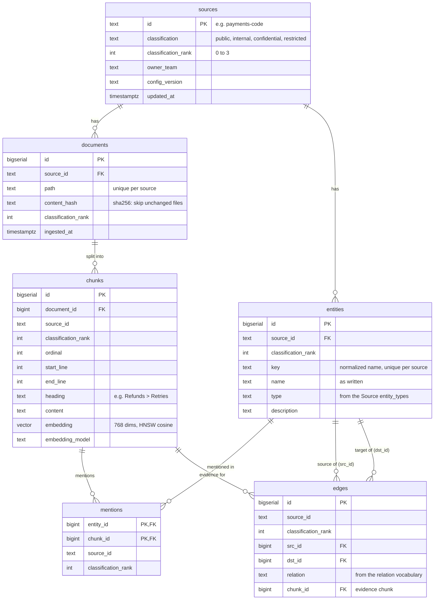

# Database schema

The knowledge store: documents, chunks with embeddings, and the knowledge graph, in PostgreSQL 17
with pgvector. Every row carries the source it came from and that source's classification, and
**row-level security (RLS) decides which rows a user's request can see**. The MCP server is the only
reader; ingest is the only writer.

Definitions live in:
- [`db/bootstrap/`](../db/bootstrap/) (Docker init) and `libs/sdlc_db/src/sdlc_db/bootstrap.py`
  (`sdlc-db bootstrap`, used everywhere else): extension, roles, schema, grants.
- [`db/migrations/`](../db/migrations/): tables, indexes and RLS policies, applied in order by `sdlc-db migrate`.
  - `001_knowledge.sql` (Stage 5): `sources`, `documents`, `chunks`.
  - `002_graph.sql` (Stage 6): `entities`, `mentions`, `edges`, `extraction_cache`.

Related: [ARCHITECTURE.md](ARCHITECTURE.md) "Data access" and "Knowledge graph".

## 1. Schema, extension and roles

Everything lives in the schema **`sdlc`**. pgvector's `vector` type lives in `public` (usage only; nobody
can create objects there). Every role has `search_path = sdlc, public`.

| Role | Used by | Can do | Bypasses RLS? |
|---|---|---|---|
| `sdlc_owner` | `sdlc-db migrate` | Owns schema `sdlc` and every table; runs migrations | No: tables use `FORCE ROW LEVEL SECURITY`, so even the owner sees no rows without context |
| `sdlc_app` (`PGUSER`) | MCP server | `SELECT` only, on the six knowledge tables | No: reads only rows matching the caller's RLS context |
| `sdlc_ingest` | `sdlc-ingest` | Read and write knowledge tables and `extraction_cache` | No: its policies allow every row, but it is still subject to RLS |
| `postgres` (admin) | `sdlc-db bootstrap`, local inspection | Creates the extension, roles and schema | Locally yes (superuser). On Cloud SQL it is `cloudsqlsuperuser`, not a real superuser |

None of the three application roles is a superuser or has `BYPASSRLS`; `sdlc-db bootstrap` **fails** if any
of them can bypass RLS. Agents get no database credentials at all. Passwords come from `.env`
(`SDLC_OWNER_PASSWORD`, `PGPASSWORD`, `SDLC_INGEST_PASSWORD`, `POSTGRES_SUPERUSER_PASSWORD`).

## 2. Entity-relationship diagram



Two standalone tables have no relationships: `extraction_cache` (ingest only) and `schema_migrations`
(migration bookkeeping).

## 3. Tables

Every data table has **`source_id`** and **`classification_rank`**: RLS filters on both, so a row is never
visible without them (even child rows such as chunks and mentions repeat them instead of relying on joins).

### `sources` (001)
The registry of knowledge sources, synced from `config/sources/*.yaml` at the start of every ingest run.

| Column | Type | Notes |
|---|---|---|
| `id` | `text` PK | Source id from config (`payments-code`, `sdlc-platform`, …) |
| `classification` | `text` | Level name from `platform.yaml` `classification_levels` |
| `classification_rank` | `integer` | Position of that level: `public`=0, `internal`=1, `confidential`=2, `restricted`=3 |
| `owner_team` | `text` | From the Source's `metadata.owner_team` |
| `config_version` | `text` | Config version that last synced it |
| `updated_at` | `timestamptz` | Last sync |

Removing a source from config deletes its row; documents and entities go with it (`ON DELETE CASCADE`).

### `documents` (001)
One row per ingested file.

| Column | Type | Notes |
|---|---|---|
| `id` | `bigserial` PK | |
| `source_id` | `text` FK → `sources.id` | Cascade on delete |
| `path` | `text` | Path relative to the source root; `UNIQUE (source_id, path)` |
| `content_hash` | `text` | SHA-256 of the file: unchanged files are skipped on re-ingest |
| `classification_rank` | `integer` | Stamped from the source |
| `ingested_at` | `timestamptz` | |

### `chunks` (001)
Retrievable pieces of a document, with their embedding.

| Column | Type | Notes |
|---|---|---|
| `id` | `bigserial` PK | |
| `document_id` | `bigint` FK → `documents.id` | Cascade on delete |
| `source_id`, `classification_rank` | `text`, `integer` | Repeated for RLS |
| `ordinal` | `integer` | Order within the document |
| `start_line`, `end_line` | `integer` | 1-based line range (shown in search results) |
| `heading` | `text` (nullable) | Markdown heading path or code definition |
| `content` | `text` | The chunk text |
| `embedding` | `vector(768)` | `gemini-embedding-2`, normalized (`platform.yaml` `knowledge.embedding`) |
| `embedding_model` | `text` | Model that produced the vector |

### `entities` (002)
Things named in a source (services, components, teams, incidents, …), extracted by Gemini at ingest.

| Column | Type | Notes |
|---|---|---|
| `id` | `bigserial` PK | |
| `source_id` | `text` FK → `sources.id` | Cascade on delete |
| `classification_rank` | `integer` | |
| `key` | `text` | Normalized name (`RefundWorker`, `refund worker` → `refund-worker`); `UNIQUE (source_id, key)` |
| `name` | `text` | As written in the source (first occurrence) |
| `type` | `text` | One of the Source's `entity_types` |
| `description` | `text` | Longest description seen |

**The graph is per source.** The same thing named in two sources is two rows with the same `key`. Queries
join them by `key` at read time, so a user only ever connects sources they can read; there are no global
entities that could leak a link to an unreadable source.

### `mentions` (002)
Which chunks mention which entities (the bridge from the graph back to text).

| Column | Type | Notes |
|---|---|---|
| `entity_id` | `bigint` FK → `entities.id` | PK part; cascade |
| `chunk_id` | `bigint` FK → `chunks.id` | PK part; cascade |
| `source_id`, `classification_rank` | | For RLS |

### `edges` (002)
Relations between entities of the same source, with the chunk that states them.

| Column | Type | Notes |
|---|---|---|
| `id` | `bigserial` PK | |
| `source_id`, `classification_rank` | | For RLS |
| `src_id`, `dst_id` | `bigint` FK → `entities.id` | Direction: subject → object (`refund-worker runs_on job-runner`); cascade |
| `relation` | `text` | From `platform.yaml` `knowledge.graph.relation_types` (or the source's subset) |
| `chunk_id` | `bigint` FK → `chunks.id` | Evidence; cascade |

`UNIQUE (src_id, dst_id, relation, chunk_id)`.

### `extraction_cache` (002)
Cached graph-extraction results, so re-ingesting unchanged text makes no model calls.

| Column | Type | Notes |
|---|---|---|
| `cache_key` | `text` PK | SHA-256 of prompt version + model + entity/relation types + chunk text |
| `result` | `jsonb` | The cleaned extraction (entities + relations) |
| `created_at` | `timestamptz` | |

Ingest only: `sdlc_app` has no grant on it at all.

### `schema_migrations` (created by `sdlc-db migrate`)
| Column | Type | Notes |
|---|---|---|
| `version` | `text` PK | Migration file name, e.g. `002_graph.sql` |
| `checksum` | `text` | SHA-256 of the file: editing an applied migration fails the next `migrate` |
| `applied_at` | `timestamptz` | |

## 4. Indexes

| Index | On | Purpose |
|---|---|---|
| `chunks_embedding_hnsw` | `chunks USING hnsw (embedding vector_cosine_ops)` | Nearest-neighbour search. Queries set `hnsw.iterative_scan = relaxed_order` and `hnsw.ef_search = 100` so RLS filtering still returns k rows |
| `chunks_source`, `documents_source` | `source_id` | Per-source maintenance and filtering |
| `entities_key` | `entities (key)` | Graph walk and cross-source joins by name |
| `mentions_chunk` | `mentions (chunk_id)` | Entities of a chunk (graph seeds) |
| `edges_src`, `edges_dst` | `edges (src_id)`, `edges (dst_id)` | Walking edges in both directions |

Plus the primary keys and unique constraints listed above.

## 5. Row-level security

**Context per transaction.** `sdlc_db.scoped(conn, policy)` (`libs/sdlc_db/src/sdlc_db/scoped.py`) opens a
transaction and sets two variables with `set_config(…, true)`, which last only until the transaction ends:

| Variable | Value | Read by |
|---|---|---|
| `app.allowed_sources` | The user's **readable sources** as a text-array literal, e.g. `{eng-standards,payments-code}`: sources granted by `Source.access` whose current classification is at or below the user's ceiling | `sdlc.allowed_sources()` |
| `app.max_classification_rank` | The user's ceiling: highest `max_classification` across their roles, as a rank | `sdlc.max_classification_rank()` |

Source ids are validated before they go into the literal, so the array cannot be broken out of.

**Fail closed.** Without the variables the functions return `{}` and `-1`, so every policy matches nothing.
Pooled connections never carry one user's scope into another request, because the settings end with the
transaction.

**Policies** (same pattern on every data table):

| Policy | Role | Tables | Rule |
|---|---|---|---|
| `app_read` | `sdlc_app` | `sources`*, `documents`, `chunks`, `entities`, `mentions`, `edges` | `FOR SELECT`: `source_id = ANY(sdlc.allowed_sources()) AND classification_rank <= sdlc.max_classification_rank()` |
| `ingest_all` | `sdlc_ingest` | all six + `extraction_cache` | `USING (true) WITH CHECK (true)` |

\* On `sources` the check uses `id` instead of `source_id`.

All tables have **RLS enabled and forced**, so the rules apply to the table owner too. Two checks protect
every read: the MCP server only asks for the user's readable sources, and the database filters every row on
the same values plus the row's own classification stamp. A bug in tool code cannot widen access beyond RLS.

**Classification changes.** Raising a source's classification in config takes effect on the next request (the
source leaves `readable_sources`). Lowering it takes effect once ingest re-stamps the rows (`sync_sources`
updates `classification_rank` on all six tables); until then the stricter stamp applies.

## 6. Grants

| Role | `sources`, `documents`, `chunks`, `entities`, `mentions`, `edges` | `extraction_cache` | Sequences | Functions |
|---|---|---|---|---|
| `sdlc_app` | `SELECT` | none | none | `EXECUTE` on the two context functions |
| `sdlc_ingest` | `SELECT, INSERT, UPDATE, DELETE` | `SELECT, INSERT, UPDATE, DELETE` | `USAGE, SELECT` | `EXECUTE` |
| `sdlc_owner` | owner | owner | owner | owner |

## 7. Data lifecycle

| Step | Who | What happens in the database |
|---|---|---|
| Source sync | `sdlc-ingest` | Upsert `sources`; re-stamp `classification_rank` everywhere for changed sources; delete sources removed from config (cascade) |
| File changed | `sdlc-ingest` | In **one transaction per document**: delete the old document (its chunks, mentions and edges cascade), insert the document and chunks, upsert entities, insert mentions and edges, drop entities left without mentions |
| File unchanged | `sdlc-ingest` | Skipped by `content_hash` (unless `--force`; graph extraction then comes from `extraction_cache`) |
| File deleted | `sdlc-ingest` | Delete the document (cascade) and orphaned entities |
| Search | MCP `search_knowledge` | Nearest chunks by cosine distance, under RLS |
| Graph query | MCP `graph_query` | Vector seed → entities of the best chunks + entities named in the question → 1–2 hops over `edges` by `key` (recursive CTE) → chunks mentioning the reached entities; every step under RLS |

## 8. Migrations and setup

```text
docker compose up -d postgres         # first start runs db/bootstrap/ (extension + roles)
docker compose run --rm migrate       # sdlc-db migrate as sdlc_owner (applies db/migrations/)
docker compose run --rm ingest run --all
```

- **Bootstrap** (`sdlc-db bootstrap`, idempotent): extension `vector`, the three roles with `LOGIN NOSUPERUSER
  NOCREATEDB NOCREATEROLE NOBYPASSRLS`, schema `sdlc` owned by `sdlc_owner`, `CONNECT`/`USAGE` grants. Used for
  Cloud SQL (no init hook, no true superuser), CI and the test database.
- **Migrations** are numbered SQL files (`NNN_name.sql`), each applied in its own transaction and recorded with
  a checksum. They are **append-only**: change the schema with a new file, never by editing an applied one.

**Adding a data table** (CLAUDE.md rules): include `source_id` + `classification_rank`; `ENABLE` and `FORCE`
RLS; add an `app_read` policy for `sdlc_app` and `ingest_all` for `sdlc_ingest`; grant as in §6; add it to
`CLASSIFIED_TABLES` in `libs/sdlc_db/src/sdlc_db/knowledge.py` so classification changes re-stamp it; read it
only through `sdlc_db.scoped()`; and add RLS tests in `tests/db`.

## 9. Inspecting the data locally

Connect with any Postgres client (e.g. pgAdmin) to `127.0.0.1:5432`, database `sdlc`. As `postgres` you see
everything; as `sdlc_app` you see **nothing** until you set a context in a transaction:

```sql
BEGIN;
SELECT set_config('app.allowed_sources', '{eng-standards,payments-code}', true),
       set_config('app.max_classification_rank', '1', true);   -- what a payments developer sees
SELECT source_id, count(*) FROM sdlc.chunks GROUP BY 1;
ROLLBACK;
```

## 10. Where the code is

| Concern | Code |
|---|---|
| RLS context | `libs/sdlc_db/src/sdlc_db/scoped.py` |
| Search, source sync, document writes | `libs/sdlc_db/src/sdlc_db/knowledge.py` |
| Graph writes, graph search, extraction cache | `libs/sdlc_db/src/sdlc_db/graph.py` |
| Roles and schema setup | `libs/sdlc_db/src/sdlc_db/bootstrap.py`, `db/bootstrap/` |
| Migrations runner | `libs/sdlc_db/src/sdlc_db/migrate.py` |
| Tests | `tests/db/test_knowledge_rls.py`, `tests/db/test_graph_rls.py` (throwaway `sdlc_test` database) |

Possible future database backends (AlloyDB, Spanner) and what each would change: see `docs/FUTURE_UPDATES.md`
on the `future-assessment` branch.
