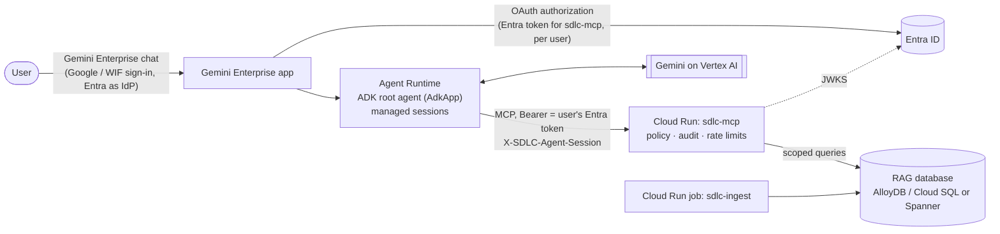

# Future updates: Gemini Enterprise Agent Runtime, MCP on Cloud Run, RAG database options

Assessment of 2026-09-27. Nothing here is built yet: development stays on localhost + the Cloudflare
Tunnel, and GCP work is deferred ([IMPLEMENTATION_PLAN.md](IMPLEMENTATION_PLAN.md) Stage 7). Product
names and APIs (Agent Runtime / Vertex AI Agent Engine, Gemini Enterprise authorizations, Memory Bank,
Spanner vector and graph features) must be re-checked when the work starts.

## 1. Target

- **Agents** run in **Gemini Enterprise's Agent Runtime** (Vertex AI Agent Engine). Users talk to them in
  **Gemini Enterprise chat**; conversations use its **managed sessions**.
- The **MCP server stays on Cloud Run**, as already designed in [GCP_DEPLOYMENT.md](GCP_DEPLOYMENT.md).
- The **RAG database** is either Postgres-compatible (AlloyDB / Cloud SQL) or **Cloud Spanner**: the choice
  is open (§6).
- **Decisions so far:** no Gemini Enterprise memory (Memory Bank) for now; database decided later.



## 2. Extent of changes

| Area | Extent | Why |
|---|---|---|
| Agent hosting (Agent Runtime) | **Medium, mostly removal** | Package `root_agent` as an `AdkApp`; the web tier (`sdlc_web`, oauth2-proxy, SQLite sessions, retention) is replaced by Gemini Enterprise chat + managed sessions |
| User identity to the MCP server | **Medium, the critical path** | Users sign in to Gemini Enterprise with Google/WIF identities, but the MCP server trusts only Entra tokens: a Gemini Enterprise OAuth authorization must obtain an Entra token per user and hand it to the agent |
| Memory (Memory Bank) | **None now** | Decision: managed sessions only. Enabling memory later is a governance item (§4) |
| MCP server on Cloud Run | **Small** | Already designed and in Terraform (Stage 7a); a few additions (§5) |
| RAG database: AlloyDB / Cloud SQL | **Small** | Postgres-compatible: pgvector, row-level security, roles, graph queries and all tests stay |
| RAG database: Spanner | **Large** | No Postgres row-level security, no pgvector/HNSW, no recursive CTE: data-access code, migrations, ingest writes and database tests are rewritten (§6) |

## 3. Agents on Agent Runtime

**Reused as-is**
- `agents/bootstrap/agent.py`: `McpToolset` with `agent_header_provider` (user token + conversation id).
- `sdlc_agent.with_team_context`: team instructions and context per session via `get_agent_context`.
- `sdlc_auth.adk.get_user_token`: already reads the user's token from session state for this surface.
- Everything on the MCP side: tools, policy, audit, config model.

**New**
- A deploy component (e.g. `agents/deploy/`) that wraps `root_agent` in `AdkApp` and creates or updates the
  Agent Runtime resource (Terraform or the `vertexai.agent_engines` API), then registers the agent in the
  Gemini Enterprise app. Settings: `SDLC_MCP_URL` (Cloud Run MCP URL), model, Vertex project/location.

**Not used on this surface** (kept for local development with adk web)
- `libs/sdlc_web` (token re-validation, user binding, `/dev` restrictions, `/run_live`), oauth2-proxy, the
  `sdlc-app` Cloud Run service, SQLite conversations and their retention job. Gemini Enterprise signs users
  in and keeps each user's sessions to themselves.

**Sessions and tracing**
- Agent Runtime managed sessions replace SQLite (see ARCHITECTURE.md "Conversation storage"); set their
  retention there.
- The conversation id still travels as `X-SDLC-Agent-Session`, so audit correlation and "one MCP session
  per conversation" are unchanged.
- Agent Runtime traces go to Cloud Trace; the MCP server exports OTLP to Cloud Trace too, and trace context
  keeps flowing inside MCP requests (`_meta`).

## 4. Identity: an Entra token for each Gemini Enterprise user

```mermaid
sequenceDiagram
    autonumber
    actor U as User
    participant GE as Gemini Enterprise
    participant E as Entra ID
    participant A as Agent (Agent Runtime)
    participant M as MCP server (Cloud Run)
    U->>GE: chat (signed in via Workforce Identity Federation, Entra as IdP)
    GE->>E: first use: authorization-code flow for scope api://<sdlc-mcp>/access_as_user
    E-->>GE: user's Entra access token (+ refresh)
    GE->>A: run the agent; token in session state under the authorization id
    A->>M: MCP call, Authorization: Bearer <user's Entra token>
    M->>M: validate token, groups / app roles, block list, rate limits, audit
```

- **Entra:** register a client for Gemini Enterprise (a new `sdlc-gemini-enterprise` app is cleaner than
  reusing `sdlc-client`) with Gemini Enterprise's redirect URI and the `access_as_user` permission. This is
  a tenant change made by an admin.
- **Gemini Enterprise:** an OAuth authorization with Entra's authorize and token endpoints (host from
  `platform.yaml` `identity.authority_host`), that client and the scope above, attached to the agent.
- **Code:** make the state key configurable in `libs/sdlc_auth/src/sdlc_auth/adk.py` (e.g.
  `SDLC_USER_TOKEN_STATE_KEY` = the authorization id). No other agent change.
- **Must be verified first:** the token must not be persisted in session history (or, later, memory).
  Tokens are never stored (CLAUDE.md). If Gemini Enterprise persists it, a callback moves it to
  invocation-scoped state and removes it from what is saved.
- **MCP server:** unchanged. Enterprise tenants make group overage more likely: prefer Entra app roles
  (plan gap E1) or configure the Graph fallback.
- **Enterprise gaps that become mandatory:** E4 (certificates or federated credentials instead of client
  secrets), E5 (Entra apps in Terraform `azuread`), E6 (no Azure CLI pre-authorization).

### Memory and Gemini Enterprise data features

**Decision: no memory for now.** If Memory Bank is enabled later:
- The risk is that memories built from tool results keep confidential snippets after the user loses
  access (group removal, a raised classification, the block list). The MCP server's per-request checks do
  not apply to memories.
- Controls: memories scoped to the user; generated from the user's own messages, not from tool results (or
  tagged with source + classification and filtered on recall); a TTL in line with conversation retention;
  purge a user's memories when they are blocked or leave.

Never connect the knowledge sources to Gemini Enterprise's own data connectors or grounding: that would
bypass `Source.access` and row-level security. Knowledge stays behind the MCP server.

## 5. MCP server on Cloud Run

Already designed and in Terraform (`infra/gcp`, Stage 7a). Additions:
- **Ingress:** private (Agent Runtime → MCP over Private Service Connect / VPC), or public with the Entra
  token as the gate, as designed today.
- **Tracing:** OTLP export to Cloud Trace.
- **Block list:** `blocked.yaml` mounted from Secret Manager, like `groups.yaml`.
- **Rate limits:** a shared store (Memorystore/Redis) once more than one instance runs; limits are per
  instance today.
- **Config:** GCS bundles with Pub/Sub reload (Stage 7b); the bundle format and verification already exist.

## 6. RAG database: Postgres-compatible or Spanner

**Decision: decide later.** Choose Spanner only for a concrete reason such as scale, multi-region or an
organisation standard. Keep `sdlc_db`'s public functions (`search`, `graph_search`, `replace_document`,
`sync_sources`, `scoped`) as the seam, so a second backend can be added without touching the MCP tools or
the ingest pipeline logic.

**AlloyDB / Cloud SQL (small change).** Keeps pgvector, row-level security, the three database roles, the
recursive graph walk and every test. Only connection settings and Terraform change; AlloyDB's ScaNN index
is optional.

**Spanner (large change).** What depends on Postgres today, and what it becomes:

| Today (Postgres) | Where | On Spanner |
|---|---|---|
| Row-level security with FORCE + per-transaction session variables: the database itself refuses rows outside the user's readable sources and classification | `sdlc_db/scoped.py`, `db/migrations/001_knowledge.sql`, `002_graph.sql` | No per-request row-level security. Scoping moves into query code: one mandatory filter on source and classification rank for every query. That loses the database as the last line of defense; compensate with a single query module, read-only fine-grained access roles for the MCP server, and tests that every query is scoped |
| pgvector HNSW index with iterative scan | `sdlc_db/knowledge.py`, `graph.py` | `COSINE_DISTANCE` nearest-neighbour or an ANN vector index; check recall together with the scope filter |
| Recursive CTE graph walk | `sdlc_db/graph.py` | Spanner Graph (GQL property graph over entities and edges): a good fit, but a rewrite |
| Roles, `sdlc-db bootstrap`, SQL migrations | `sdlc_db/bootstrap.py`, `migrate.py` | Spanner DDL via schema-update operations and fine-grained access database roles |
| Ingest writes | `replace_document`, `write_graph`, extraction cache | Spanner mutations / read-write transactions |
| Database tests (throwaway Postgres, CI pgvector service) | `tests/db`, `.github/workflows/ci.yml` | Spanner emulator (check vector and graph support) or a test instance |

Cost differs too: Spanner has a minimum capacity, and vector search and graph need its Enterprise edition.

## 7. Phasing (when GCP resumes)

1. Stage 7a as designed: MCP server on Cloud Run with a Postgres-compatible database. It does not depend on
   the agent move.
2. Identity spike: Gemini Enterprise authorization → Entra token in agent state; the same
   `whoami(explain)` as in adk web (the Stage 8 gate); the token is not persisted.
3. Agent Runtime deployment and Gemini Enterprise registration; session retention; tracing.
4. Later, if wanted: Memory Bank with the controls in §4, behind a flag.
5. Database decision. For Spanner: a new `sdlc_db` backend behind the current functions, then ingest, then
   tests.

## 8. How to verify (when implemented)

- The same user gets the same `whoami(explain)` and tool list in Gemini Enterprise chat, adk web and
  Antigravity (compare the MCP audit records, as done for Antigravity).
- Session state (and memory, if enabled) holds no access tokens; memories are gone after a user is blocked.
- The persona matrix and its data rows pass on the chosen database; a query without scope returns nothing
  (the Postgres row-level security test, or its Spanner query-layer equivalent).
- The retrieval eval (`tests/evals`) is not worse than the Postgres baseline.
