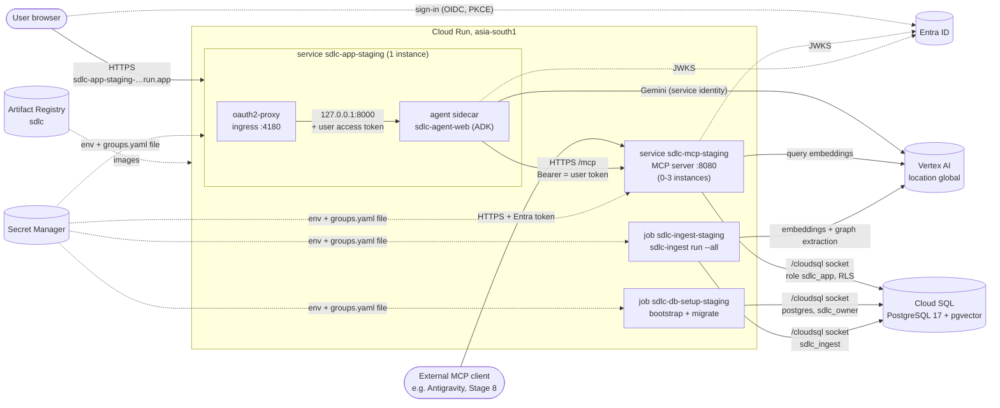
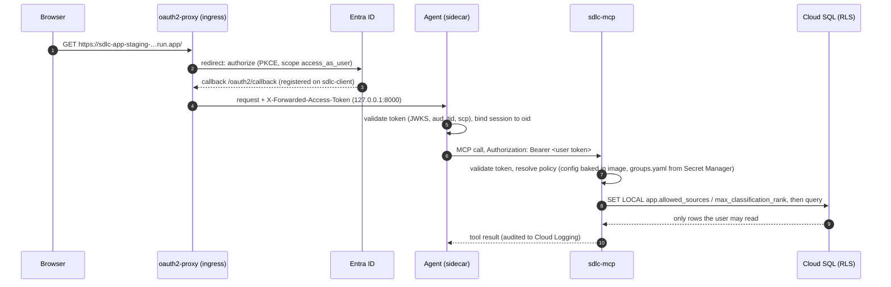
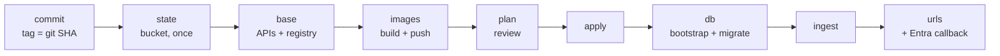

# GCP deployment (Stage 7)

How agentic-sdlc runs on Google Cloud: the target design, the resources Terraform creates, how
identity and secrets flow, and how to deploy, update and tear down an environment.
Related: [ARCHITECTURE.md](ARCHITECTURE.md) §7–8 (environments), [infra/README.md](../infra/README.md)
(files), [IMPLEMENTATION_PLAN.md](IMPLEMENTATION_PLAN.md) Stage 7 (decisions, progress).

## 1. Status (2026-09-27)

**Deferred to a later stage.** The current development phase runs on localhost and the Cloudflare
Tunnel only ([ARCHITECTURE.md](ARCHITECTURE.md) §7, [CLOUDFLARE_TUNNEL.md](CLOUDFLARE_TUNNEL.md)).
This design is kept current so the deployment can resume when GCP is needed.

Stage 7 is split into **7a deploy** (this document) and **7b operations** (config bundles with
hot reload, `sdlc-config compile`, CI promotion, custom hostnames, scale-out session stores).

| Item | State |
|---|---|
| Terraform (`infra/gcp`), deploy script (`scripts/gcp_deploy.ps1`), `sdlc-db bootstrap` | Built and committed |
| State bucket `gs://cloud-migration-agent-sdlc-tfstate` (versioned, no public access) | Created |
| APIs (Run, Cloud SQL Admin, Secret Manager, Artifact Registry, Vertex AI, IAM) | Enabled |
| Artifact Registry `asia-south1-docker.pkg.dev/cloud-migration-agent/sdlc` | Created; images `mcp-bootstrap`, `agent-bootstrap`, `ingest` (tag `57f55cc3ef68`) and mirrored `oauth2-proxy:v7.15.4-alpine` pushed |
| Staging OAuth callback on the `sdlc-client` Entra app | Registered |
| Cloud SQL, secrets, service accounts, Cloud Run services and jobs (43 resources) | **Deferred**: not created |

What exists costs cents per month (bucket and registry storage). The deferred part is where the
cost is (mainly Cloud SQL, see §9).

## 2. Decisions

| Topic | Decision | Why |
|---|---|---|
| Scope | 7a deploy first, 7b operations after testing | Something testable early |
| Project / region | Existing `cloud-migration-agent`, `asia-south1` (Mumbai) | Billing and Vertex already set up; closest region. Vertex model calls use location `global` |
| Environment | `staging` (`SDLC_ENV=staging`, `config/env/staging/`) | First higher environment |
| Endpoints | Cloud Run's own `*.run.app` URLs | No DNS or load balancer cost for the first test. A temporary exception to the rule "higher environments use a CNAME + managed certificate"; custom hostnames return in 7b |
| Entra | Staging callback added to the existing `sdlc-client` | Simplest; a per-environment client app is the enterprise path (plan gaps E4/E5) |
| Database | Cloud SQL PostgreSQL 17 + pgvector, Enterprise edition, `db-g1-small`, zonal | Smallest tier that fits HNSW indexes; same engine as local |
| Deploy tooling | Terraform + PowerShell script (Windows PowerShell 5.1 or `pwsh`) | Windows dev machine; the same script can run in Linux CI with `pwsh` |

Organization policy findings (read-only check before designing):

| Constraint | Effective value | Consequence |
|---|---|---|
| `iam.allowedPolicyMemberDomains` | Restricted to the org's domains | No `allUsers` invoker binding: public services set Cloud Run **`invoker_iam_disabled`** |
| `run.managed.requireInvokerIam` | Not enforced | `invoker_iam_disabled` is allowed |
| `sql.restrictAuthorizedNetworks` | Enforced | Fits the design: Cloud SQL is reached only through the connector |
| `sql.restrictPublicIp` | Not enforced | Public IP (for the connector) is allowed; private IP is a later hardening |
| `run.allowedIngress`, `gcp.resourceLocations` | Allow all | No constraint |

## 3. Architecture on GCP



- **`sdlc-app-<env>`**: two containers in one instance. oauth2-proxy is the ingress container:
  it signs the user in with Entra and forwards requests with the user's access token to the
  agent, which listens on `127.0.0.1:8000` and cannot be reached any other way. The agent
  re-validates the token and binds the session to the user, as locally. **Max 1 instance**
  while ADK sessions are in memory (7b adds a session store). The agent has no DB credentials.
- **`sdlc-mcp-<env>`**: public and stateless, so it scales out (0–3 instances). Every request
  must carry a valid Entra token for the sdlc-mcp API; policy, RLS context and audit work
  exactly as locally.
- **Jobs**: `sdlc-db-setup` creates roles, schema and RLS (`sdlc-db bootstrap` + `migrate`);
  `sdlc-ingest` builds the knowledge store and graph from the sample corpus baked into the image.
- **Public without `allUsers`**: both services set `invoker_iam_disabled` (see §2). Cloud Run
  does not check Google IAM; authentication is Entra's job (oauth2-proxy, token validation).

### Sign-in and a request on staging



## 4. Resources (Terraform, `infra/gcp`)

| File | Resources | Notes |
|---|---|---|
| `main.tf` | 6 `google_project_service`, Artifact Registry `sdlc` | Locals compute the deterministic URLs `https://<service>-<project number>.<region>.run.app` before the services exist, so each service is configured with its own public URL (`MCP_PUBLIC_URL`, OAuth redirect) |
| `sql.tf` | Instance `sdlc-<env>` (PG 17, Enterprise, `db-g1-small`, zonal, 10 GB autoresize, backups on, `ENCRYPTED_ONLY`), database `sdlc`, user `postgres` | Public IP for the connector only, no authorized networks |
| `secrets.tf` | Generated passwords (`admin`, `owner`, `app`, `ingest`), cookie secret; 7–8 secrets + versions `sdlc-<env>-*` | Entra client secret, optional Graph secret and `groups.yaml` come from local git-ignored files |
| `iam.tf` | Service accounts `sdlc-<env>-mcp`, `-app`, `-jobs`; project roles; per-secret accessor bindings | See §5 |
| `run.tf` | Services `sdlc-mcp-<env>`, `sdlc-app-<env>`; jobs `sdlc-db-setup-<env>`, `sdlc-ingest-<env>` | Secrets as env vars (`version = latest`); `groups.yaml` as a file at `/app/config/env/<env>/`; Cloud SQL socket at `/cloudsql` |
| `outputs.tf` | `app_url`, `oauth_callback`, `mcp_url`, `registry`, `sql_connection_name`, `jobs` | |
| `<env>.tfvars`, `<env>.gcs.tfbackend` | Project, region, env, tier, deletion protection; state bucket + prefix | No tenant IDs in either |

The plan for staging: **50 resources** in total (7 already created by `base`, 43 deferred).

## 5. Identity, access and secrets

| Workload | Service account | Project roles | Secrets it can read |
|---|---|---|---|
| `sdlc-mcp` | `sdlc-<env>-mcp` | Cloud SQL Client, Vertex AI User | `pg-app-password`, `groups-yaml`, `entra-graph-secret` (if set) |
| `sdlc-app` | `sdlc-<env>-app` | Vertex AI User | `oauth2-cookie`, `entra-client-secret` |
| jobs | `sdlc-<env>-jobs` | Cloud SQL Client, Vertex AI User | `pg-admin-password`, `pg-owner-password`, `pg-app-password`, `pg-ingest-password`, `groups-yaml` |

- **No key files**: Vertex AI and Cloud SQL use each workload's service identity. The local ADC
  file mount does not exist on GCP.
- **Database roles** are the same as locally: `sdlc_owner` (migrations), `sdlc_app` (MCP, read-only),
  `sdlc_ingest` (writes); none can bypass RLS, and every data table uses FORCE ROW LEVEL SECURITY.
  Cloud SQL's `postgres` is `cloudsqlsuperuser`, not a real superuser: `sdlc-db bootstrap` handles
  that (it grants itself membership of `sdlc_owner` to create the schema, only re-sets passwords on
  existing roles) and **fails if any role can bypass RLS**.
- **Secrets** live in Secret Manager. Their values are also in the Terraform state (GCS bucket with
  uniform access and no public access) and in a saved plan file (git-ignored, deleted by `apply`).
- **Tenant-specific values** (tenant ID, app IDs, client secret, group IDs) are read from `.env` and
  `config/env/<env>/groups.yaml` at deploy time and never committed.
- **Entra**: the staging callback `https://sdlc-app-staging-<project number>.asia-south1.run.app/oauth2/callback`
  is registered on `sdlc-client` next to the local and tunnel callbacks.

## 6. Configuration on GCP

- **7a**: `config/` and `skills/` are baked into the images at build time (one config version per
  release); `SDLC_ENV=staging`; file watching is off (`SDLC_CONFIG_WATCH=false`). The only
  environment-specific file, `groups.yaml`, is stored in Secret Manager and mounted as a file.
- **7b**: config bundles in `gs://sdlc-config-<env>/` with a `current` pointer, Pub/Sub reload,
  last-known-good, rollback by pointer flip (see "Runtime Config Exposure" in the plan).

## 7. Deployment



From the repo root, in PowerShell (Docker Desktop running, `gcloud` signed in, Terraform installed):

```powershell
.\scripts\gcp_deploy.ps1 -EnvName staging -Step state    # state bucket (once per project)
.\scripts\gcp_deploy.ps1 -EnvName staging -Step base     # APIs + Artifact Registry
.\scripts\gcp_deploy.ps1 -EnvName staging -Step images   # build + push mcp/agent/ingest, mirror oauth2-proxy
.\scripts\gcp_deploy.ps1 -EnvName staging -Step plan     # writes infra/gcp/staging.tfplan; review it
.\scripts\gcp_deploy.ps1 -EnvName staging -Step apply    # ~10-15 min (Cloud SQL)
.\scripts\gcp_deploy.ps1 -EnvName staging -Step db       # sdlc-db bootstrap + migrate on Cloud SQL
.\scripts\gcp_deploy.ps1 -EnvName staging -Step ingest   # sample corpus: chunks, embeddings, graph
.\scripts\gcp_deploy.ps1 -EnvName staging -Step urls     # app URL, MCP URL, OAuth callback
```

- **Image tag = commit SHA.** `images` and `plan` refuse to run with uncommitted changes. To re-plan
  without rebuilding, pass the pushed tag: `-ImageTag 57f55cc3ef68`.
- **Confirmation**: `base` and `apply` ask before changing anything unless `-AutoApprove`.
- **Why a mirror for oauth2-proxy**: Cloud Run pulls only from Artifact Registry or Docker Hub, and
  oauth2-proxy is published on quay.io.
- **Updates**: commit → `images` → `plan` → `apply`. Schema changes: add a migration, then `db`.
  Content changes: `ingest` (unchanged files and cached graph extractions cost nothing).
- **Resuming the deferred deployment**: the saved plan was discarded; run `plan` again (with
  `-ImageTag 57f55cc3ef68`, or rebuild images from the current commit), then `apply`, `db`, `ingest`.

## 8. Verification (7a gate)

On staging, repeat the Stage 1–6 gates with the same test users:

1. Sign in at the `app_url`: paul, ana, the payments-lead account and ben land in the agent UI.
2. `whoami` shows each user's own teams and roles; tool lists differ per persona.
3. Skills and team context per user (`list_skills`, `get_agent_context`).
4. `search_knowledge` and `graph_query` return only each user's sources; the payments lead also
   sees the confidential incidents.
5. Audit records in Cloud Logging (`jsonPayload.event` for `tool_call`, `tools_list`, `auth_failure`):
   `gcloud logging read 'resource.labels.service_name="sdlc-mcp-staging"' --limit 50`.

## 9. Cost (asia-south1, rough, per month)

| Item | Estimate |
|---|---|
| Cloud SQL `db-g1-small`, 10 GB SSD, backups | ~US$25–35 (runs continuously) |
| Cloud Run services and jobs | ~US$0–5 (scale to zero; requests only) |
| Secret Manager, Artifact Registry storage, state bucket | < US$1 |
| Vertex AI (embeddings, flash calls for the sample corpus and tests) | cents |

Teardown removes everything created by `apply` (deletion protection is off for staging only):

```powershell
cd infra/gcp; terraform destroy -var-file=staging.tfvars   # needs the same TF_VAR_* as plan
```

## 10. Next (7b and hardening)

- Custom hostnames `app-sdlc-staging` / `mcp-sdlc-staging.shaheenks.co.in`: CNAME + Google-managed
  certificate (load balancer or domain mapping), then drop the `*.run.app` exception.
- Persistent ADK session store and an oauth2-proxy session store, so `sdlc-app` can scale out.
- Config bundles + Pub/Sub reload, `sdlc-config compile`, CI (validate → diff → test → build → plan → apply).
- Per-environment Entra client app, certificates or federated credentials instead of client secrets
  (plan gaps E4, E5, E8); Cloud SQL private IP.
